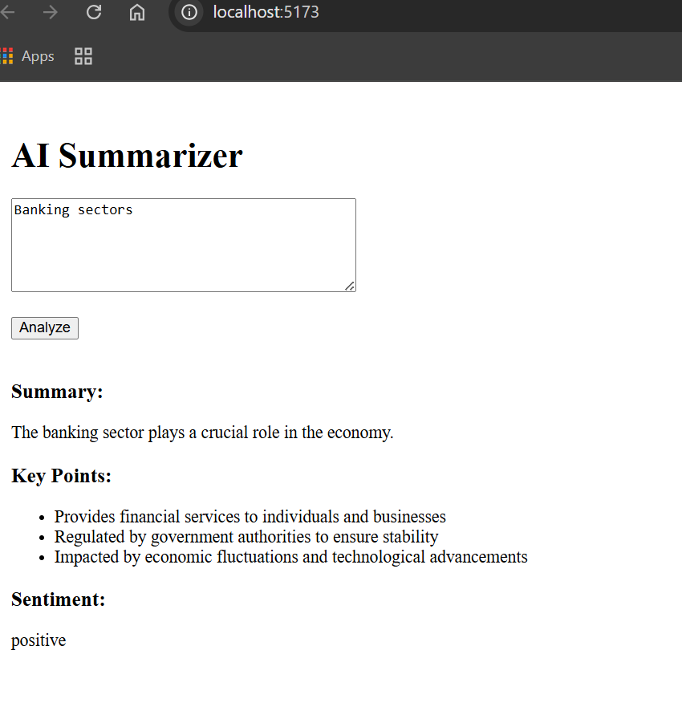

AI Text Summarizer

A minimal full-stack application that converts unstructured text into a structured summary using an LLM (Large Language Model).
The app takes user input, processes it via a backend API, and returns a clean JSON output containing a summary, key points, and sentiment.

---

🚀 Tech Stack

- Frontend: React (Vite)
- Backend: Node.js + Express
- LLM API: OpenRouter (OpenAI-compatible)
- Other Tools: dotenv, cors, fetch

---

🎯 Features

- Accepts unstructured text input
- Sends data securely to backend API
- Uses LLM to generate structured output
- Returns:
  - One-line summary
  - Three key points
  - Sentiment (positive / neutral / negative)
- Displays results in a simple UI
- Basic validation and error handling

---

🧠 How It Works

1. User enters text in the React UI
2. Frontend sends a POST request to "/api/summarize"
3. Backend validates input
4. Backend sends prompt to LLM API
5. LLM returns structured JSON
6. Backend sends response to frontend
7. UI displays summary, key points, and sentiment

---

📁 Project Structure

assignment-summarizer/

client/
src/
App.jsx

server/
src/
index.js
llm.js
prompt.js

.env.example
README.md

---

⚙️ Setup Instructions

1. Clone Repository

git clone <your-repo-link>
cd assignment-summarizer

---

2. Backend Setup

cd server
npm install

Create ".env" file:

OPENAI_API_KEY=your_api_key_here

Run server:

node src/index.js

Server runs on: http://localhost:5000

---

3. Frontend Setup

cd client
npm install
npm run dev

Frontend runs on: http://localhost:5173

---

🔑 API Used

This project uses OpenRouter (OpenAI-compatible API) to access LLM models.
Chosen because:

- Easy integration
- Free-tier availability
- Compatible with OpenAI SDK

---

🧾 Prompt Design

The prompt is designed to enforce strict JSON output:

- Ensures consistent structure
- Avoids parsing errors
- Restricts output format

Example:

{
"summary": "one sentence",
"keyPoints": ["point 1", "point 2", "point 3"],
"sentiment": "positive | neutral | negative"
}

---

📌 Example Output

Input:

AI is transforming industries through automation and efficiency improvements.

Output:

{
"summary": "AI is transforming industries through automation.",
"keyPoints": [
"AI improves efficiency",
"Automation is increasing",
"Industries are evolving"
],
"sentiment": "positive"
}

---

⚠️ Error Handling

- Empty input validation
- Minimum text length check
- API failure handling
- Invalid JSON response handling

---

⚖️ Trade-offs

- Minimal UI to focus on backend and LLM logic
- Single API endpoint for simplicity
- No authentication (not required for assignment)
- Limited validation to keep scope small

---

🚀 Future Improvements

- File upload support
- Batch text processing
- Better UI/UX
- Custom output schema
- Response caching

---

🧪 How to Test

1. Start backend and frontend
2. Enter sample text
3. Click "Analyze"
4. View structured output

---

🎤 Interview Notes

- Backend is used to protect API keys
- Prompt ensures strict JSON output
- Focused on simplicity and clarity over complexity

---
[Render link} : https://ai-summarizer-oqlx.onrender.com/
📄 License

This project is created for an AI Developer Intern assignment and is intended for evaluation purposes.

